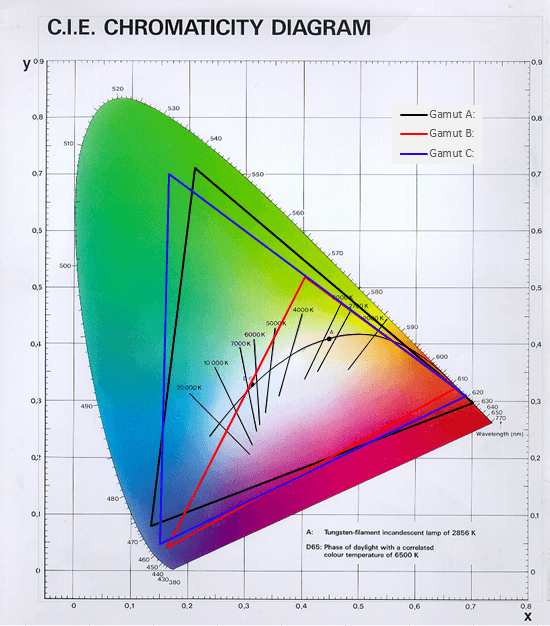

# ColorConverter in JS
Converts rgb values to gamut values. 
Used by the philips hue system:

 
This converter is able to convert rgb values to all three gamuts as seen in the image

# Usage
Import the color converter... 
    
    const c = require("./colorConverter");

... and use the convert function. Or just copy the code :grin:

    c.convert(r, g, b);

where r, g, b are values between 0 and 255

The convert function returns xy values as an array like this:

    c.convert(0, 0, 255); // returns [0.089, 0.019]